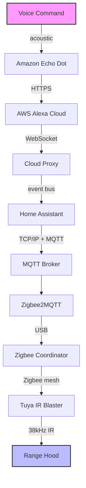

It all started with a simple, everyday annoyance in the kitchen. 

My wife would be in the middle of cooking, hands covered in flour, oil, or whatever was being prepped for dinner, and the kitchen would start filling with smoke. Our range hood works perfectly fine, but it is completely "dumb"—controlled exclusively by a small, analog infrared remote. Having to stop, wash her hands, find the little plastic remote, and press the right buttons just to clear the air was a daily friction point. 

I wanted to build a seamless experience. The goal was simple: allow her to just say, *"Alexa, turn on the range hood,"* and have the system automatically ramp up the extractor fan and turn on the overhead lamp. 

To bridge the gap between a modern voice assistant and a 1980s-era infrared receiver, I picked up an inexpensive, battery-powered Zigbee IR blaster. After finding a good line-of-sight spot for it, I tied it into my local server using Zigbee2MQTT and Home Assistant, grouping the specific IR codes for the fan speed and light into a single virtual "switch" that Alexa could recognize.

From a user perspective, it’s a simple voice command. But from an engineering perspective, the chain of events required to make this happen is staggering.

## The Journey of a Voice Command

When someone stands in the kitchen and asks Alexa to turn on the hood, an incredibly complex, multi-protocol relay race triggers across oceans, local networks, and silicon chips—all within a fraction of a second.

Here is exactly what happens under the hood:

### 1. The Acoustic Trigger (Sound Waves to the Cloud)
The voice command creates mechanical sound waves that hit the microphones on the Echo. The local hardware digitizes the audio, detects the wake word, and instantly establishes a secure, encrypted connection to Amazon’s servers. The cloud handles the heavy lifting of processing the natural language, figuring out that the user wants to trigger the entity named "Range Hood."

### 2. The Cloud-to-Home Handshake (APIs to Local WebSockets)
Amazon's cloud realizes this device doesn't belong to them; it's managed by my local Home Assistant server. It fires a command to a secure proxy endpoint, which sends the directive down a persistent WebSocket tunnel directly into my house. This safely punches through the home router's firewall instantly, without needing open ports.

### 3. The Brain of the House (Home Assistant Event Bus)
My local Home Assistant server intercepts the incoming cloud event. Its internal state engine flips the virtual "Range Hood" switch to "ON". Because I programmed this switch to run a sequence, Home Assistant sequentially queues up the exact commands needed: press the *Speed Up* button, wait exactly one second so the hardware buffer doesn't jam, and then press the *Light* button.

### 4. The Local Network Relay (TCP/IP to MQTT)
Home Assistant packages these commands into tiny JSON payloads and ships them over the local network via TCP/IP to an MQTT broker. The broker acts like a digital post office, reading the address on the packet and instantly routing it to the Zigbee2MQTT service listening in the background.

### 5. The Wireless Mesh (Serial to Zigbee)
Zigbee2MQTT translates that JSON payload into a standard radio command. It sends this command via USB to my physical Zigbee coordinator antenna. The antenna encodes the data into a 2.4 GHz radio frequency packet and broadcasts it across my home's Zigbee mesh network, hopping from smart plug to smart bulb until it reaches the battery-powered IR blaster on the kitchen cabinet.

### 6. The Final Hop (Digital Logic to Infrared Photons)
The microcontroller inside the IR blaster wakes up, receives the radio packet, and decodes it back into an array of microsecond timings. It feeds these timings into an LED, which flashes rapidly, modulating invisible 940nm light waves at a strict 38kHz frequency. These photons blast across the kitchen, bounce off the tiles, and hit the photodiode receiver on the range hood. The hood decodes the light back into a binary command and closes a physical relay, spinning up the fan motor.

## An Engineering Miracle

When you map out the entire architecture, it feels like an absolute miracle that this works at all. 

To avoid touching a plastic button with messy hands, we are combining cutting-edge cloud neural networks, global fiber-optic routing, containerized home servers running publish/subscribe event loops, low-power wireless mesh topologies executing cryptographic framing, and primitive flashing light beams. 

Yet, all of this staggering complexity happens seamlessly, reliably, and completely invisibly in less than a second. It’s a profound showcase of interconnected network engineering hiding quietly behind a simple, everyday convenience.