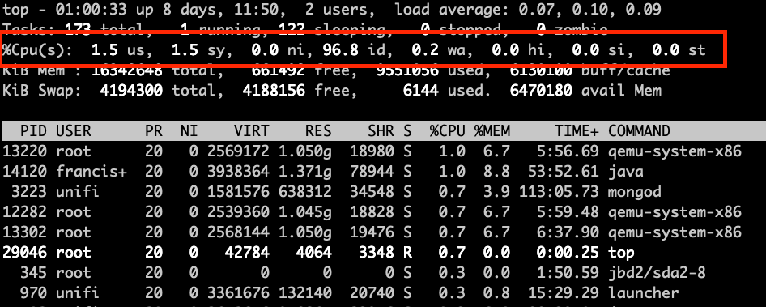

In a past blog post I talked about [The misunderstood load average in linux hosts](), while load average is a good metric to watch in linux systems to catch generic performance problems, it does not reveal what the issue might be. This time I will dig more into cpu metrics collected from a linux system and explain them, for this purpose I will use multipass vms, and will be showing metrics from [grafana](https://grafana.com/) screnshots which take the data from [prometheus](https://prometheus.io/) and [prometheus node exporter](https://github.com/prometheus/node_exporter) (this is actually out of the scope of this post). To gather some metrics I will run a few vms in my home linux server and do some stress tests to catch some operations that will show in the cpu metrics and explain what each one of them is.


# Install vms

For the tests as I metioned before I will be running vms using multipass, and adding some configuration to them using ansible to get some basic software in order to look at the metrics in prometheus.  
Preparing vms for running tests.
```bash
# Start vms with multipass
$ for i in {1..5}
> do cat <<EOF | multipass launch --name testvm${i} -m 1G --cloud-init -
> users:
>   - default
>   - name: francisco
>     sudo: ALL=(ALL) NOPASSWD:ALL
>     groups: users, admin
>     ssh_import_id: None
>     lock_passwd: true
>     ssh_authorized_keys:
>       - ssh-rsa AAAAB3NzaC1yc2EAAAADAQABAAACAQC4/CTfClQTZ5iCpje5irALaz2XcQq9fbG2M1coXYwrAOv77HaeAUnBjEfiEl6IF/FnCLFRD3im/CHsOAgMzg1vKAjBJaeve4gaz+ikkNkZ/KT8R4vz7PncvO1yFQiLGYDyTqWfk+GvZ8OZ4tPgiGZsmbNg/qKZbwRUUvg9bberm5BCQL+TjNJjoVHJnOgg3Y1XJ7LtcbZV3e5It1U3SikohTD0v3RHAfHeOEJKS02SWiIDToMEejYwEuuQ4UY3dkb/vOVeHYLYUOuVVnHYU9/yGOS1e4pIOOocSTCUFdQfg/aOmVjbSc1ifjqUpfBQT3tnNSSTT50KRFkRw7T8tuBl1m9rZ0pt538nzAPKzUE22OZmbD1Fv1HBq/B4F16vW6HmjFRha9AjoTX838mhgwt3CUzt6iKkIURz4A/kW/gaWTcw4TEoEHHa1KHhTP7eQrRu16fzU2ZTqfa+rDEhrZlpLtKS6BH1nM4wHLHSi/3cNN6udZ0QS3K+Dv5kPWCs9Nw9BIih+iI885ofmz85oePjcLFsMOCRb3s1D51WIsFCjGI5hseBi3BH8kF9vtFKu3m8lioVsAVJIglTOWibJ7bONzkcNT08/66nCNC1h461BmZ+q7NsIwULlleuiiD7a2KTKX/olCPK4vph4/QsORvwqUE1AtvKLaWvlOqLlj+N+Q== franciscocastello@gmail.com
> EOF
> done
Launched: testvm1
Launched: testvm2
Launched: testvm3
Launched: testvm4
Launched: testvm5
done

$ mkdir ansible
$ cd ansible
$ echo "[all]" > inventory
$ multipass list --format json | jq .list[].ipv4[] | cut -d"\"" -f2 >> inventory
$ virtualenv -p python3 .env
Already using interpreter /usr/bin/python3
Using base prefix '/usr'
New python executable in /root/ansible/.env/bin/python3
Also creating executable in /root/ansible/.env/bin/python
Installing setuptools, pkg_resources, pip, wheel...done.
$ source .env/bin/activate
(.env)$ pip install ansible
(.env)$ cat <<EOF | tee ansible.cfg
[defaults]
roles_path          = .env/roles
inventory           = inventory
retry_files_enabled = False
host_key_checking   = False
gathering           = smart
stdout_callback     = debug
callback_whitelist  = timer, profile_tasks
[ssh_connection]
pipelining          = True
control_path        = ~/.ansible/cp/ansible-ssh-%%h-%%p-%%r
ssh_args            = -o RequestTTY=no -o StrictHostKeyChecking=no -o UserKnownHostsFile=/dev/null -o ControlMaster=auto -o ControlPersist=60s
EOF

(.env)$ ansible-galaxy role install fcastello.docker
- downloading role 'docker', owned by fcastello
- downloading role from https://github.com/fcastello/ansible-docker/archive/0.0.4.tar.gz
- extracting fcastello.docker to /home/francisco/ansible/.env/roles/fcastello.docker
- fcastello.docker (0.0.4) was installed successfully

(.env)$ ansible-galaxy role install fcastello.node_exporter_docker
- downloading role 'node_exporter_docker', owned by fcastello
- downloading role from https://github.com/fcastello/ansible-node-exporter-docker/archive/0.0.1.tar.gz
- extracting fcastello.node_exporter_docker to /home/francisco/ansible/.env/roles/fcastello.node_exporter_docker
- fcastello.node_exporter_docker (0.0.1) was installed successfully

(.env)$ cat <<EOF | tee config.yml
---
- name: configure vm(s)
  hosts: "all"
  gather_facts: yes
  become: yes
  tasks:
    - name: "Install docker"
      import_role:
        name: fcastello.docker
    - name: "Run node exporter"
      import_role:
        name: fcastello.node_exporter_docker
EOF
(.env)$ ansible-playbook config.yml
PLAY [configure vm(s)] ******************************************************************************************************************************************************

TASK [Gathering Facts] ******************************************************************************************************************************************************
Saturday 11 July 2020  19:08:23 +0000 (0:00:00.147)       0:00:00.147 *********
ok: [10.0.100.108]
ok: [10.0.100.43]
ok: [10.0.100.99]
ok: [10.0.100.157]
ok: [10.0.100.112]

TASK [fcastello.docker : install basic required software] *******************************************************************************************************************
Saturday 11 July 2020  19:08:30 +0000 (0:00:07.632)       0:00:07.779 *********
changed: [10.0.100.112]
changed: [10.0.100.99]
changed: [10.0.100.157]
changed: [10.0.100.43]
changed: [10.0.100.108]

TASK [fcastello.docker : Add docker gpg apt key] ****************************************************************************************************************************
Saturday 11 July 2020  19:16:30 +0000 (0:07:59.158)       0:08:06.939 *********
changed: [10.0.100.157]
changed: [10.0.100.108]
changed: [10.0.100.99]
changed: [10.0.100.43]
changed: [10.0.100.112]

TASK [fcastello.docker : get architecture] **********************************************************************************************************************************
Saturday 11 July 2020  19:16:35 +0000 (0:00:05.547)       0:08:12.486 *********
changed: [10.0.100.108]
changed: [10.0.100.99]
changed: [10.0.100.112]
changed: [10.0.100.157]
changed: [10.0.100.43]

TASK [fcastello.docker : Add Docker apt repository] *************************************************************************************************************************
Saturday 11 July 2020  19:16:36 +0000 (0:00:01.170)       0:08:13.656 *********
changed: [10.0.100.108]
changed: [10.0.100.99]
changed: [10.0.100.112]
changed: [10.0.100.157]
changed: [10.0.100.43]

TASK [fcastello.docker : Install docker-ce package] *************************************************************************************************************************
Saturday 11 July 2020  19:17:01 +0000 (0:00:24.326)       0:08:37.983 *********
changed: [10.0.100.157]
changed: [10.0.100.43]
changed: [10.0.100.108]
changed: [10.0.100.99]
changed: [10.0.100.112]

TASK [fcastello.node_exporter_docker : make sure python-docker package is present] ******************************************************************************************
Saturday 11 July 2020  19:19:07 +0000 (0:02:06.153)       0:10:44.136 *********
ok: [10.0.100.157]
ok: [10.0.100.108]
ok: [10.0.100.99]
ok: [10.0.100.112]
ok: [10.0.100.43]

TASK [fcastello.node_exporter_docker : make sure the diretory for text collectors exist] ************************************************************************************
Saturday 11 July 2020  19:19:12 +0000 (0:00:05.616)       0:10:49.752 *********
changed: [10.0.100.112]
changed: [10.0.100.99]
changed: [10.0.100.157]
changed: [10.0.100.108]
changed: [10.0.100.43]

TASK [fcastello.node_exporter_docker : run prometheus node exporter] ********************************************************************************************************
Saturday 11 July 2020  19:19:14 +0000 (0:00:01.295)       0:10:51.048 *********
changed: [10.0.100.108]
changed: [10.0.100.99]
changed: [10.0.100.43]
changed: [10.0.100.112]
changed: [10.0.100.157]

PLAY RECAP ******************************************************************************************************************************************************************
10.0.100.108               : ok=9    changed=7    unreachable=0    failed=0    skipped=0    rescued=0    ignored=0
10.0.100.112               : ok=9    changed=7    unreachable=0    failed=0    skipped=0    rescued=0    ignored=0
10.0.100.157               : ok=9    changed=7    unreachable=0    failed=0    skipped=0    rescued=0    ignored=0
10.0.100.43                : ok=9    changed=7    unreachable=0    failed=0    skipped=0    rescued=0    ignored=0
10.0.100.99                : ok=9    changed=7    unreachable=0    failed=0    skipped=0    rescued=0    ignored=0

Saturday 11 July 2020  19:19:32 +0000 (0:00:18.173)       0:11:09.221 *********
===============================================================================
fcastello.docker : install basic required software ----------------------------------------------------------------------------------------------------------------- 479.16s
fcastello.docker : Install docker-ce package ----------------------------------------------------------------------------------------------------------------------- 126.15s
fcastello.docker : Add Docker apt repository ------------------------------------------------------------------------------------------------------------------------ 24.33s
fcastello.node_exporter_docker : run prometheus node exporter ------------------------------------------------------------------------------------------------------- 18.17s
Gathering Facts ------------------------------------------------------------------------------------------------------------------------------------------------------ 7.63s
fcastello.node_exporter_docker : make sure python-docker package is present ------------------------------------------------------------------------------------------ 5.62s
fcastello.docker : Add docker gpg apt key ---------------------------------------------------------------------------------------------------------------------------- 5.55s
fcastello.node_exporter_docker : make sure the diretory for text collectors exist ------------------------------------------------------------------------------------ 1.30s
fcastello.docker : get architecture ---------------------------------------------------------------------------------------------------------------------------------- 1.17s
Playbook run took 0 days, 0 hours, 11 minutes, 9 seconds
```

Now we have our host and 5 vms to start playing around with the cpu and looking at metrics and explaint what they are.


# CPU metrics

To start viewing usage lets talk about what are the different components of cpu metrics. For that we can take a look at a screenshot for the `top` command.  

CPU metrics in the top command show the percentage spent in each one of this "states", we will talk more about what they are.
- `us` a.k.a user: this is the cpu time used by userspace processes. Most applications will show up within this percentage when they are using cpu.
- `sy` a.k.a system: this is the cpu time spend by kernel processes, everytime there is interacion from user space processes, or I/O, or processing network traffic; anything that need to interact with the kernel will show up within this percentage.
- `ni` a.k.a. nice: this is the cpu time spent by userspace processed that had been `niced`. Setting nice to a process will control the priority this process, this can be used to set priority lower when the process is invasive, or set to higher priority when the process need more guarateed cpu time, for example realtime applications. When a userspace process has been set with nice it will show in this metric.
- `id` a.k.a. idle: this is the time where the cpu was idle, pretty much waiting to be used. In busy sistems this will hae a low value, and in not busy systems this will be high.
- `wa` a.k.a. iowait: this is the time that the cpu was spent by waiting for I/O to happen. This value willl be high when there is a lot of access to disk or accessing hardware. But mostly will be when we are doing heavy reading/writing to disk.
- `hi` a.k.a hardware interrupt or `si` a.k.a. software interrupt: This is the time the cpu spent processing interrupts, interrupts can be processed also by software with processes called softirqd or when the kernel spent time procesing a hardware interrupt. Either `hi` and `si` will mean that there is interaction with the hardware happening. A normal case would be that this will spike when having high network traffic as the network card will generate lots of interrupts and it will affect the cpu usage.
- `st` a.k.a. steal: this is the time spent waiting to get cpu time. This value will only show up when running in virtualized environments. The steal value means that someone else (a.k.a another virtual machine most likely) was using the cpu in this time, this happens when multiple virtual machines are charing the same cores. It's a veru interesteing metrics to watch, specially when we are running vm's in the cloud or when we run virtual machines. Helps identify if the undelying host is underprovisioned or identify "noisy neighbors".

Next I will do some test to try to spike each one of the values and show some situations that we might fing in cpu metrics which will help us understand more the usage in the server we are watching.

