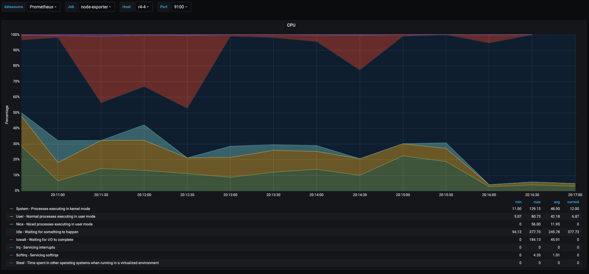
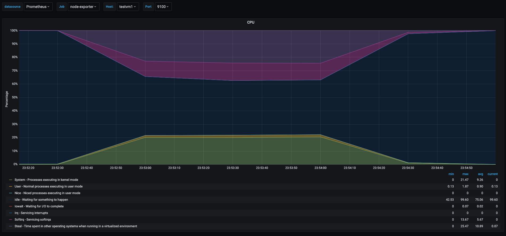
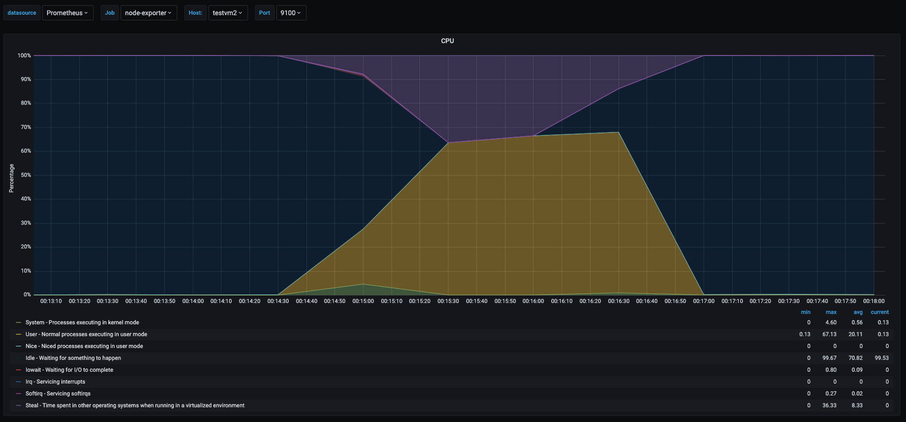

In a past blog post I talked about [The misunderstood load average in linux hosts](), while load average is a good metric to watch in linux systems to catch generic performance problems, it does not reveal what the issue might be. This time I will dig more into cpu metrics collected from a linux system and explain them, for this purpose I will use multipass vms, and will be showing metrics from [grafana](https://grafana.com/) screnshots which take the data from [prometheus](https://prometheus.io/) and [prometheus node exporter](https://github.com/prometheus/node_exporter) (this is actually out of the scope of this post). To gather some metrics I will run a few vms in my home linux server and do some stress tests to catch some operations that will show in the cpu metrics and explain what each one of them is.


# Install vms

For the tests as I metioned before I will be running vms using multipass, and adding some configuration to them using ansible to get some basic software in order to look at the metrics in prometheus.  
Preparing vms for running tests.
```bash
# Start vms with multipass
$ for i in {1..3}
do cat <<EOF | multipass launch --name testvm${i} -m 1G --cloud-init -
users:
  - default
  - name: testuser
    sudo: ALL=(ALL) NOPASSWD:ALL
    groups: users, admin
    ssh_import_id: None
    lock_passwd: true
    ssh_authorized_keys:
      - ssh-rsa AAAAB3NzaC1yc2EAAAADAQABAAABAQCyrauoMmTD5Ar2MAvYd7hCXPKXLR75MabnZvMLyNxFVdbEX0M8Sz+UKIlnOGGUwoFgcl1xj7Bt7oUS/TVWBRBP/r9DQ47FxUZkEBycTty6hESkTSs56If7jMio56ygSTghA1aMYP8mGmVdcjWH0DYc1xgJylfvjuuUEaLJyMvWZeVGwUhPbX3/wqNSsGXczSTRJuYqfL+/tcAAs2u74Hg0YdY8GTT6pcKtchdsR4o9zih6MQktIotvAYinaD71inaggrN67DqIH8MfKk97jE8IIn1wjtMphuZEdRdVvn4ZbYQok1Fnm1kTelxLNWNar8h9hwGRx0O0lQyG1Todl3yL testuser
> EOF
> done
Launched: testvm1
Launched: testvm2
Launched: testvm3
done

$ mkdir ansible
$ cd ansible
$ echo "[all]" > inventory
$ multipass list --format json | jq .list[].ipv4[] | cut -d"\"" -f2 >> inventory
$ virtualenv -p python3 .env
Already using interpreter /usr/bin/python3
Using base prefix '/usr'
New python executable in /root/ansible/.env/bin/python3
Also creating executable in /root/ansible/.env/bin/python
Installing setuptools, pkg_resources, pip, wheel...done.
$ source .env/bin/activate
(.env)$ pip install ansible
(.env)$ cat <<EOF | tee ansible.cfg
[defaults]
roles_path          = .env/roles
inventory           = inventory
retry_files_enabled = False
host_key_checking   = False
gathering           = smart
stdout_callback     = debug
callback_whitelist  = timer, profile_tasks
[ssh_connection]
pipelining          = True
control_path        = ~/.ansible/cp/ansible-ssh-%%h-%%p-%%r
ssh_args            = -o RequestTTY=no -o StrictHostKeyChecking=no -o UserKnownHostsFile=/dev/null -o ControlMaster=auto -o ControlPersist=60s
EOF

(.env)$ ansible-galaxy role install fcastello.docker
- downloading role 'docker', owned by fcastello
- downloading role from https://github.com/fcastello/ansible-docker/archive/0.0.4.tar.gz
- extracting fcastello.docker to /home/francisco/ansible/.env/roles/fcastello.docker
- fcastello.docker (0.0.4) was installed successfully

(.env)$ ansible-galaxy role install fcastello.node_exporter_docker
- downloading role 'node_exporter_docker', owned by fcastello
- downloading role from https://github.com/fcastello/ansible-node-exporter-docker/archive/0.0.1.tar.gz
- extracting fcastello.node_exporter_docker to /home/francisco/ansible/.env/roles/fcastello.node_exporter_docker
- fcastello.node_exporter_docker (0.0.1) was installed successfully

(.env)$ cat <<EOF | tee config.yml
---
- name: configure vm(s)
  hosts: "all"
  gather_facts: yes
  become: yes
  tasks:
    - name: "Install docker"
      import_role:
        name: fcastello.docker
    - name: "Run node exporter"
      import_role:
        name: fcastello.node_exporter_docker
    - name: "install iperf"
      apt:
        name: iperf
        state: present
EOF
(.env)$ ansible-playbook config.yml
PLAY [configure vm(s)] ******************************************************************************************************************************************************

TASK [Gathering Facts] ******************************************************************************************************************************************************
Saturday 11 July 2020  19:08:23 +0000 (0:00:00.147)       0:00:00.147 *********
ok: [10.0.100.43]
ok: [10.0.100.99]
ok: [10.0.100.157]

TASK [fcastello.docker : install basic required software] *******************************************************************************************************************
Saturday 11 July 2020  19:08:30 +0000 (0:00:07.632)       0:00:07.779 *********
changed: [10.0.100.99]
changed: [10.0.100.157]
changed: [10.0.100.43]

TASK [fcastello.docker : Add docker gpg apt key] ****************************************************************************************************************************
Saturday 11 July 2020  19:16:30 +0000 (0:07:59.158)       0:08:06.939 *********
changed: [10.0.100.157]
changed: [10.0.100.99]
changed: [10.0.100.43]

TASK [fcastello.docker : get architecture] **********************************************************************************************************************************
Saturday 11 July 2020  19:16:35 +0000 (0:00:05.547)       0:08:12.486 *********
changed: [10.0.100.99]
changed: [10.0.100.157]
changed: [10.0.100.43]

TASK [fcastello.docker : Add Docker apt repository] *************************************************************************************************************************
Saturday 11 July 2020  19:16:36 +0000 (0:00:01.170)       0:08:13.656 *********
changed: [10.0.100.99]
changed: [10.0.100.157]
changed: [10.0.100.43]

TASK [fcastello.docker : Install docker-ce package] *************************************************************************************************************************
Saturday 11 July 2020  19:17:01 +0000 (0:00:24.326)       0:08:37.983 *********
changed: [10.0.100.157]
changed: [10.0.100.43]
changed: [10.0.100.99]

TASK [fcastello.node_exporter_docker : make sure python-docker package is present] ******************************************************************************************
Saturday 11 July 2020  19:19:07 +0000 (0:02:06.153)       0:10:44.136 *********
ok: [10.0.100.157]
ok: [10.0.100.99]
ok: [10.0.100.43]

TASK [fcastello.node_exporter_docker : make sure the diretory for text collectors exist] ************************************************************************************
Saturday 11 July 2020  19:19:12 +0000 (0:00:05.616)       0:10:49.752 *********
changed: [10.0.100.99]
changed: [10.0.100.157]
changed: [10.0.100.43]

TASK [fcastello.node_exporter_docker : run prometheus node exporter] ********************************************************************************************************
Saturday 11 July 2020  19:19:14 +0000 (0:00:01.295)       0:10:51.048 *********
changed: [10.0.100.99]
changed: [10.0.100.43]
changed: [10.0.100.157]

PLAY RECAP ******************************************************************************************************************************************************************
10.0.100.157               : ok=9    changed=7    unreachable=0    failed=0    skipped=0    rescued=0    ignored=0
10.0.100.43                : ok=9    changed=7    unreachable=0    failed=0    skipped=0    rescued=0    ignored=0
10.0.100.99                : ok=9    changed=7    unreachable=0    failed=0    skipped=0    rescued=0    ignored=0

Saturday 11 July 2020  19:19:32 +0000 (0:00:18.173)       0:11:09.221 *********
===============================================================================
fcastello.docker : install basic required software ----------------------------------------------------------------------------------------------------------------- 479.16s
fcastello.docker : Install docker-ce package ----------------------------------------------------------------------------------------------------------------------- 126.15s
fcastello.docker : Add Docker apt repository ------------------------------------------------------------------------------------------------------------------------ 24.33s
fcastello.node_exporter_docker : run prometheus node exporter ------------------------------------------------------------------------------------------------------- 18.17s
Gathering Facts ------------------------------------------------------------------------------------------------------------------------------------------------------ 7.63s
fcastello.node_exporter_docker : make sure python-docker package is present ------------------------------------------------------------------------------------------ 5.62s
fcastello.docker : Add docker gpg apt key ---------------------------------------------------------------------------------------------------------------------------- 5.55s
fcastello.node_exporter_docker : make sure the diretory for text collectors exist ------------------------------------------------------------------------------------ 1.30s
fcastello.docker : get architecture ---------------------------------------------------------------------------------------------------------------------------------- 1.17s
Playbook run took 0 days, 0 hours, 11 minutes, 9 seconds
```

Now we have our host and 3 vms to start playing around with the cpu and looking at metrics and explaint what they are.


# CPU metrics

To start viewing usage lets talk about what are the different components of cpu metrics. For that we can take a look at a screenshot for the `top` command.  


CPU metrics in the top command show the percentage spent in each one of this "states", we will talk more about what they are.
- `us` a.k.a user: this is the cpu time used by userspace processes. Most applications will show up within this percentage when they are using cpu.
- `sy` a.k.a system: this is the cpu time spend by kernel processes, everytime there is interacion from user space processes, or I/O, or processing network traffic; anything that need to interact with the kernel will show up within this percentage.
- `ni` a.k.a. nice: this is the cpu time spent by userspace processed that had been `niced`. Setting nice to a process will control the priority this process, this can be used to set priority lower when the process is invasive, or set to higher priority when the process need more guarateed cpu time, for example realtime applications. When a userspace process has been set with nice it will show in this metric.
- `id` a.k.a. idle: this is the time where the cpu was idle, pretty much waiting to be used. In busy sistems this will hae a low value, and in not busy systems this will be high.
- `wa` a.k.a. iowait: this is the time that the cpu was spent by waiting for I/O to happen. This value willl be high when there is a lot of access to disk or accessing hardware. But mostly will be when we are doing heavy reading/writing to disk.
- `hi` a.k.a hardware interrupt or `si` a.k.a. software interrupt: This is the time the cpu spent processing interrupts, interrupts can be processed also by software with processes called softirqd or when the kernel spent time procesing a hardware interrupt. Either `hi` and `si` will mean that there is interaction with the hardware happening. A normal case would be that this will spike when having high network traffic as the network card will generate lots of interrupts and it will affect the cpu usage.
- `st` a.k.a. steal: this is the time spent waiting to get cpu time. This value will only show up when running in virtualized environments. The steal value means that someone else (a.k.a another virtual machine most likely) was using the cpu in this time, this happens when multiple virtual machines are charing the same cores. It's a veru interesteing metrics to watch, specially when we are running vm's in the cloud or when we run virtual machines. Helps identify if the undelying host is underprovisioned or identify "noisy neighbors".

Next I will do some tests to try to spike each one of the values and show some situations that we might fing in cpu metrics which will help us understand more the usage in the server we are watching. I will also show some sittuations that I recorded in my home lab doing other tests.  
Most tests were perfomed in the vms that we created at the start of the post and they were added to a prometheus/grafana setup using the node exporter we installed there, which is out of the scope of this blog post.

## Idle server
On of the easiest situations to catch is to know that our server is idle, or doing nothing. This is particularly usefull when I want to find servers that have been overprovisioned and are being undeused. Catching servers with high `idle` metrics will helpo ups either get smalled vms if we are running in the cloud, saving us some money or to know this server can be used for more applications and opimizing the usage of servers.  


We can see the cpus usage of one of the newly created vms named testvm1. In this graph we can see most of the area is painted in blue, showing that most of the percentage time of the cpu as spend in `idle` which means that this vm is doing nothing at the time of shown in the graph.

## Userspace usage
Other common use case we catch with cpu metrics is to see applications running in userspace that use the cpu. This is normal and we should expect to see this percentage go higher when applications are busier.
To generate userspace usage in one of the vms, for that will will run a container to stress test the cpu
```bash
# log in to testvm1
$ multipass shell testvm1

# Run docker container that will hog 1 cpu
ubuntu@testvm1:~$ sudo docker run -it --name cpustress --rm containerstack/cpustress --cpu 1 --timeout 90s --metrics-brief
Unable to find image 'containerstack/cpustress:latest' locally
latest: Pulling from containerstack/cpustress
c76b39ada3ed: Pull complete
badc43fe7dea: Pull complete
Digest: sha256:a72da3632d53fc69a5f60715a1b594b56e1a7d94c40963efbd4cdc37ca37d77e
Status: Downloaded newer image for containerstack/cpustress:latest
stress-ng: info: [1] dispatching hogs: 1 cpudocker run -it --name cpustress --rm containerstack/cpustress --cpu 1 --timeout 90s --metrics-brief
stress-ng: info: [1] successful run completed in 90.05s
stress-ng: info: [1] stressor      bogo ops real time  usr time  sys time   bogo ops/s   bogo ops/s
stress-ng: info: [1]                          (secs)    (secs)    (secs)   (real time) (usr+sys time)
stress-ng: info: [1] cpu              12992     90.05     88.83      0.01       144.28       146.24
```
We ran a cpu stress test for 90 seconds and we can see the screenshots of the metrics.


In the graph we can see the during the stress test of the cpu, the testvm1 spiked the user space usage, shown as the yellow area, off course the stress test took all available cpu at the time of the test, but we can see a tiny spike in the green area which shows the time spent in kernelspace processes, this is because even userspace processes can have interaction throught with the kernel deending on the tasks the process is doing. 


 I show a screenshot of the top command when the stress test war running and it shows the percentages the process was running, however top shows the instant values and not the history.  
 Now let's take a look at the underlyng host running testvm1


This last graph shows the cpu usage of the host running the vms, as we can see teh yellow area spiked to 50% when the stress test was being run. This is do to the fact that the vm was assinged only 1 vcpu and the physical host has 2 cores.

## High I/O
In this section I will show something I gathered from other tests I was running in a raspberry pi kubernetes cluster, this was handy as I recently was playing with that cluster and I already had the data to show this kind of situations.  
So this test was a raspberry pi running a kubernetes node and that snapshot of the graph was taken at the time when I was scaling a deployment from 5 to 50 pods. This generated a lot of metrics there which I will explain.



This graph gets more interesting as we have many things happening there.  
- Red area: is the percentage the cpu spent in iowait. Which means it was waiting to for read/writes to the disk, in this case makes sense as it was probably downloading container images and writing them to the disk. The value seems very high, but considering that the raspberry pi is writing to an sd card which is slow this value makes sense. In my experience, on systems where this value goes above 20% or 30% you will experience some performance issues, off course it depends on what the server is running and the applications tolerance to latency.
- Blue area: idle time, I am nt going to explain this one as it was already explained before
- Yellow area: userspace percentage, also not going to explain as it ewas already explained.
- Green area: this is processes running in kernel space, in this case it made sense as kubernetes was probably doing a lot of operations at the kernel level to start and schedule containers on the node. Also when having high I/O also there is a spike in kernelspace processes as all reads/writes pass thorugh the kernel somehow.
- Light Blue Area: this is the time spent by processes that were `niced` which means that either were assinge higher or lower prioritie than the rest of the processes. In this case it makes sense as probably at the moment kubernetes was running a process that needed more priority than others, or the other way around. In fact this will give as a hint to investgate further what those process were and how to optimize if they were causing issues.

## High interrupts
In this case to test a scenario that generates a high amount of interrupts I will run a network traffic stress test between testvm1 and the physical host, for that we will use `iperf` tool already installed with the ansible playbook.

On testvm1 start iperf as server
```bash
ubuntu@testvm1:~$ iperf -s
------------------------------------------------------------
Server listening on TCP port 5001
TCP window size:  128 KByte (default)
------------------------------------------------------------
```

On the testvm2 run iperf as client
```bash
ubuntu@testvm1:~$ iperf -c testvm1 -t 90
------------------------------------------------------------
Client connecting to 10.0.100.1, TCP port 5001
TCP window size: 85.0 KByte (default)
------------------------------------------------------------
[  3] local 10.0.100.43 port 42832 connected with 10.0.100.1 port 5001
[ ID] Interval       Transfer     Bandwidth
[  3]  0.0-90.0 sec  92.8 GBytes  8.86 Gbits/sec
```
This will generate a lot of interrupts for the entwork card, even if it's a virtual card the network card's driver will generate interrupts.  
Let's look at the graph.



In this graph we can see spikes when the network stress test was being performed. I will go into details on the values that makes sense for this use case and not explain what has already been explained.

- Light purple area: time spend by the softirq system in the kernel. This is the time percentage that cpu took to process irqs generated by the network card due to the hight traffic that was generated by the network stress test.
- Green area: there is also a spike in the kernel space processes and this is due to the network traffic also generates a lot of other kernel space processes to use the CPU
- Yellow area: even though the test was performed by a userspace process, it did use the cpu much but the network traffic the userspace process generated spiked irqs and kernels space processing for hanlding the network packets.
- Dark purple area: this is the steal time in the cpu and it will be explained in the next section.

## Noisy Neighbors

In this case I will show a test that will show in cpu metrics if we have "noisy neighbors" running on the same physical host. This means that we can see if other vms are affectin our vm by looking at the cpu percentages.  

For this test I will run the cpu stress test for 90 seconds in testvm1, testvm2 and testvm3

```bash
# Log in to all vms and run the following
# run the docker container to stress the cpu
$ sudo docker run -it --name cpustress --rm containerstack/cpustress --cpu 1 --timeout 90s --metrics-brief
```
Following I will show the graphs for all 3 vms.





As we can see the cpu usage pattern in the 3 vms was very similar. But there is an interesitng part.

- Yellow area: this time we can see that the userspace percentage never got to 100% like the it was shown in the userspace section. This is due to the fact that there were 3 vms trying to use 100% of their vcpus but the underlying host has only 2 cores, which translates to each vm having 
less cpu time for them as the physical cores are shared among the 3 vms.
- Purple area: in each graph thisn shows the percent if time other vms has stolen cpu from this vm.

This is a particular scenario were it is useful to know if my vm is being affected by other vms running on the same host. When we are running in virtualized environments this might indicate that the underlying physical host is oversubscribed.


# Conclusion

There are many situations where the cpu might become a bottleneck, cpu metrics are quite revealing and will give us a hint what to look for next to find the issue that is caussing performance problems. I wanted to show in this post with examples of common problems I have seen in production systems and I wanted to reproduce them and explain how to get an interpretation out of the metrics. I explained a few situations the will catch most performance problems when it comes to cpu, and sometimes not even cpu but the metrics will "tell" us where else to look. for example high iowait in cpu is telling us to look more what is happeing with i/o, specially on disks, maybe we will need faster disks or optimize the application for disk access. Also catching the interrups because of network traffic might indicate us to start tunning the kernel for better netowrk performance. Or the if we see cpu steal spiking might mean that we need a bigger host or that we are running too many vms on the host.  
Anyway, thera are millions of combinations of what we can see in the cpu metrics, I wanted to reproduce common problems I faced in the past and most look similar to what I saw in production systems.  
Remeber to really understand the metrics before jumping into conclusions. Many times I miss where the issue is because the lack of understanding the metrics I am looking at, so take a few minutes and read the documetation on the metrics and that will help finding what the issue is.